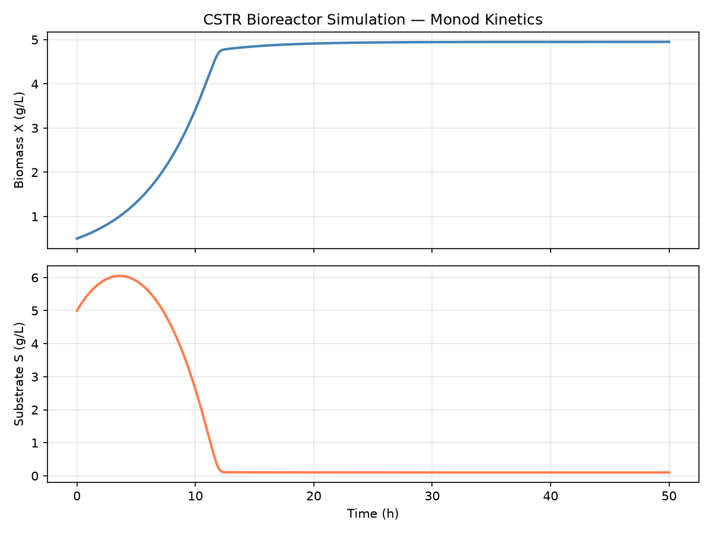
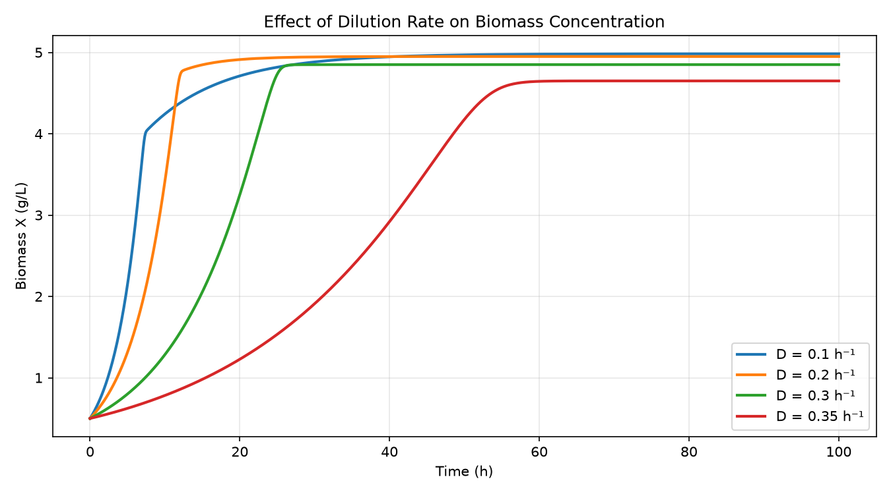

# CSTR Bioreactor Simulation — Python

A dynamic simulation of a continuous stirred tank bioreactor (CSTR) modelling biomass growth and substrate consumption using Monod kinetics and mass balance equations. Built in Python as a port of an original MATLAB model.

## Background

Continuous stirred tank bioreactors are widely used in bioprocessing to maintain steady-state microbial growth under controlled conditions. This model applies Monod kinetics to describe how specific growth rate varies with substrate concentration, and solves the resulting coupled ODEs numerically to simulate transient and steady-state reactor behaviour.

## Model equations

$$\frac{dX}{dt} = (\mu - D) \cdot X$$

$$\frac{dS}{dt} = D \cdot (S_0 - S) - \frac{\mu \cdot X}{Y}$$

$$\mu = \mu_{max} \cdot \frac{S}{K_s + S}$$

Where:
- **X** — biomass concentration (g/L)
- **S** — substrate concentration (g/L)
- **μ** — specific growth rate (h⁻¹)
- **D** — dilution rate (h⁻¹)
- **S₀** — feed substrate concentration (g/L)
- **Y** — biomass yield coefficient (g biomass / g substrate)

## Parameters

| Parameter | Symbol | Value | Units |
|---|---|---|---|
| Maximum specific growth rate | μ_max | 0.4 | h⁻¹ |
| Half-saturation constant | Ks | 0.1 | g/L |
| Yield coefficient | Y | 0.5 | g/g |
| Dilution rate | D | 0.2 | h⁻¹ |
| Feed substrate concentration | S₀ | 10.0 | g/L |

> Update these values in `simulation.py` to match your experimental or literature parameters.

## Simulations

### 1. Dynamic response (`simulation.py`)
Solves the coupled ODEs over time for a given set of operating conditions, showing how biomass and substrate evolve from initial conditions to steady state.

### 2. Dilution rate sweep (`parameter_sweep.py`)
Simulates a range of dilution rates to analyse the effect on steady-state biomass concentration. Demonstrates washout behaviour at high dilution rates.

## Sample output

## How to run

**1. Install dependencies**

**2. Run the dynamic simulation**

**3. Run the parameter sweep**

Plots are saved automatically as PNG files in the same directory.

## Tools and libraries

| Tool | Purpose |
|---|---|
| Python 3.11+ | Core language |
| scipy `solve_ivp` | Numerical ODE solver (RK45) |
| matplotlib | Plotting and figure export |
| numpy | Array operations and time vector |

## Related

- [MATLAB version](https://github.com/monther-alk/bioreactor-cstr-matlab) — original implementation in MATLAB

## Author

Monther Al Khateeb — Chemical and Biological Engineering, American University of Sharjah  
[LinkedIn](https://linkedin.com/in/monther-al-khateeb-6a1363319)
